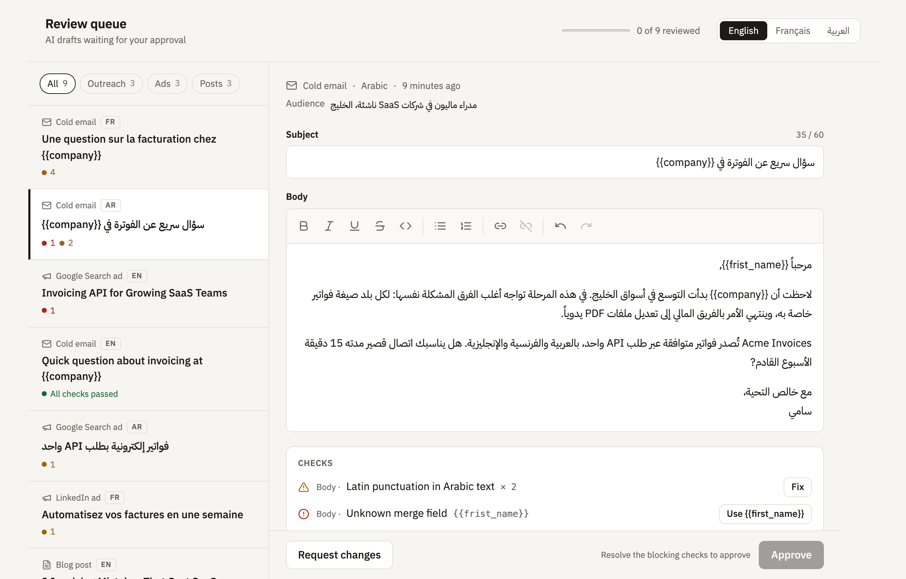

# Review queue

An approval queue for AI-written drafts in English, French and Arabic, built with [`@sidieyel/wysiwyg-editor`](../../README.md).

**[Open the live demo](https://sidieyel.github.io/wysiwyg/)**

A reviewer opens a draft, edits it in place, resolves the checks, then approves it or sends it back with a note. The queue covers three kinds of draft: cold emails, ads and blog posts.



## Run it

From the repository root:

```bash
npm install
npm run example    # http://localhost:5173
npm test           # unit tests for the checks
```

## What it shows

- **Right-to-left editing.** Arabic drafts are edited right-to-left inside a left-to-right interface, and the other way round. Latin brand names, merge fields and numbers stay in the correct order inside Arabic text.
- **Checks that know the language.** French drafts are checked for the no-break space before `: ; ! ?` and inside « ». Arabic drafts are checked for Latin punctuation (`, ; ?` instead of `، ؛ ؟`). Every draft is checked for merge fields that would be sent as literal `{{braces}}` and for the character limits of its channel.
- **One-click fixes.** A fix is applied through the editor as a single step, so the formatting is kept and one undo reverts it.
- **Blocking and non-blocking checks.** A broken merge field or a hard platform limit disables approval. A typography warning does not.
- **A fully translated interface.** The interface is available in the same three languages, and the whole layout mirrors in Arabic.

Try it: open the Arabic email, apply both fixes, then approve with `Ctrl`/`⌘` + `Enter`.

## Design notes

**Direction comes from the draft's language, not from the text.** The usual shortcut, `dir="auto"`, picks the direction from the first strong character. Marketing copy breaks that rule all the time: an Arabic paragraph that starts with "Acme Invoices" or with `{{first_name}}` would be laid out left-to-right. The queue knows each draft's language, so it sets the direction explicitly.

**The interface and the content have separate directions.** The editor's toolbar follows the interface language, and the text follows the draft's language. In the queue, titles are isolated (`<bdi>`) and keep their place in the list, whatever their direction.

**Checks are pure functions over plain text.** Each rule returns edits (`{ from, to, insert }`) and has no dependency on the DOM or the editor, which makes the rules easy to test ([`src/checks`](./src/checks)). One small adapter applies the edits to plain inputs, and another applies them to the editor's document ([`src/editor.ts`](./src/editor.ts)).

**Lengths are counted in code points.** An Arabic letter and its diacritic count as two characters, so a draft that passes here is not rejected by a platform that counts every mark.

## Structure

```
src/
  checks/        Language rules, merge fields, limits, and their tests
  components/    Queue list, draft review, checks panel
  data/          Sample drafts (fictional)
  channels.ts    Fields and character limits per channel
  editor.ts      Applies check edits to the editor document
  review.ts      Runs the checks on a draft
  state.ts       Reducer for edits and decisions
  i18n.ts        Interface strings in English, French and Arabic
```

## Limits of the example

- The queue is in memory. Decisions are not saved or sent anywhere.
- The drafts are sample data for a fictional product.
- Character limits are the common guidelines for each channel and are set in [`src/channels.ts`](./src/channels.ts).
